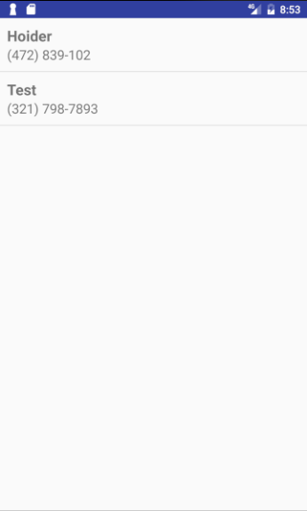

# Android certificate preparation

* [1. Fundamental Application Components][1]
  * [1a. Describe an application's key functional and nonfunctional requirements][1a]
  * [1b. Create an Activity that displays a layout resource][1b]
  * [1c. Fetch local data from disk using a Loader on a background thread][1c]

* [2. Application User Interface (UI) and User Experience (UX)][2]

* [3. Persistent Data Storage][3]

* [4. Testing and Debugging][4]

## 1. Fundamental Application Components
Understanding of Android's top-level application components (Activity, Service, Broadcast Receiver, Content Provider) and the lifecycle associated with each one. Candidates should be able to describe the types of application logic that would be best suited for each component, and whether that component is executing in the foreground or in the background. This includes strategies for determining how and when to execute background work.

### 1a. Describe an application's key functional and nonfunctional requirements
A functional requirement describes what a software system should do, while non-functional requirements place constraints on how the system will do so.

**Functional requirement example**: When a user registers, the system should send an email confirming their registration

**Non-functional requirement example**: Registration confirmation email should be sent within 30 seconds of registration

### 1b. Create an Activity that displays a layout resource
Activites are interactive windows that can either be displayed fullscreen, floating or integrated into other activities.

***The bare minimum of creating an Activity and displaying a layout:***

```java
package com.somesite.somecompany.appname.activities;

import android.app.Activity;
import android.os.Bundle;
import com.somesite.somecompany.appname.R;

public class BasicActivity extends Activity{
    @Override
    protected void onCreate(Bundle savedInstanceState) {
        super.onCreate(savedInstanceState);
        setContentView(R.layout.activity_basic);
    }
}
```

Read more about Activities on [Androids Activity Documentation][1ba] and about their lifecycle at [Android Activity Lifecycles Documentation][1bb]

### 1c. Fetch local data from disk using a Loader on a background thread
Loaders lets you load data from either Content Providers or other data sources. They are available to every Activity and Fragment, and conforms to their respective lifecycles such as onDestroy(). Loaders also observe datasources, so that they can update the UI when the underlying datasource changes. Another important thing about Loaders is that they can cache the data they fetch, making multiple visits to an Activity or Fragment more smooth as the user do not have to wait for another data fetch.

This project contains a barebones implementation of a Loader. [LoaderExampleActivity.java][1ca] loads [activity_loader_example.xml][1cb] which only contains a Fragment. This Fragment space loads [ContactLoader.java][1cc] that loads Contacts from the phone with a Loader. Once the Loader is complete it puts the returned information into [listitem_contacts][1cd] that are items displayed in [listview_contacts][1ce]. Resulting in this:



Read more about Activities on [Androids Loaders Documentation][1cf]

## 2. Application User Interface (UI) and User Experience (UX)

## 3. Persistent Data Storage

## 4. Testing and Debugging

[1]: #1-fundamental-application-components
[1a]: #1a-describe-an-applications-key-functional-and-nonfunctional-requirement
[1b]: #1b-create-an-activity-that-displays-a-layout-resource
[1ba]: https://developer.android.com/reference/android/app/Activity.html
[1bb]: https://developer.android.com/guide/components/activities/activity-lifecycle.html
[1c]: #1c-fetch-local-data-from-disk-using-a-loader-on-a-background-thread
[1ca]: #
[1cb]: #
[1cc]: #
[1cd]: ./AndroidCertificationPreparation/app/src/main/res/layout/listitem_contacts.xml
[1ce]: #
[1cf]: https://developer.android.com/guide/components/loaders.html
[2]: #2-application-user-interface-ui-and-user-experience-ux
[3]: #3-persistant-data-storage
[4]: #4-testing-and-debugging
